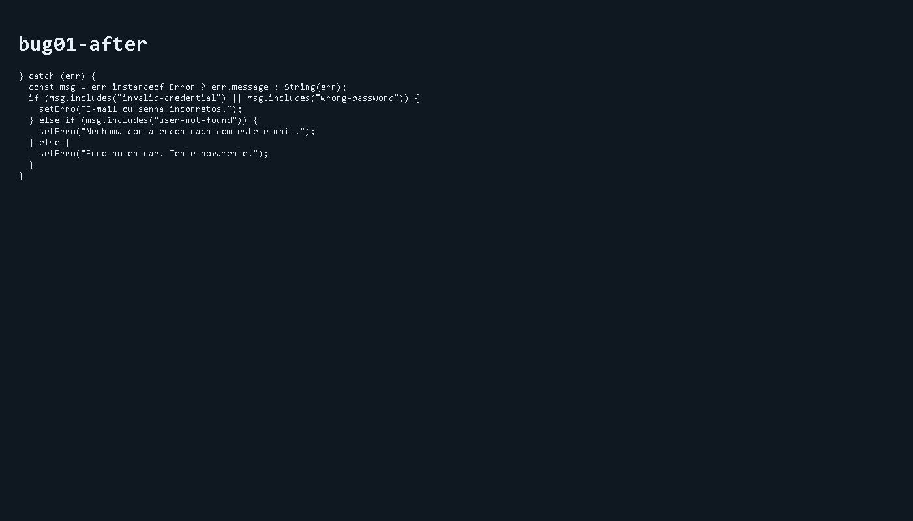
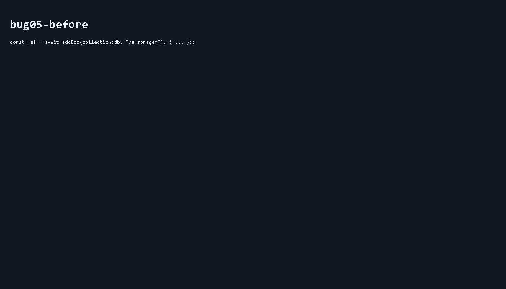
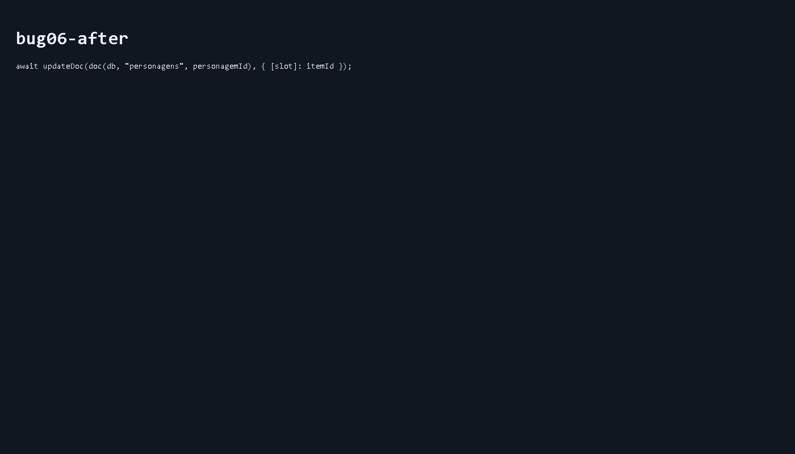

# RELATÓRIO DE CORREÇÃO DE BUGS

Este relatório documenta as correções aplicadas aos 8 bugs plantados no repositório.
Para cada bug há: descrição, como era antes (trecho), e como ficou depois (trecho), e uma breve explicação técnica.

---

## Bug 01 — Login silencia erros
Arquivo: src/app/(auth)/login/page.tsx

Antes:
```ts
} catch {
  // catch vazio — erro engolido
}
```
Depois:
```ts
} catch (err) {
  const msg = err instanceof Error ? err.message : String(err);
  if (msg.includes("invalid-credential") || msg.includes("wrong-password")) {
    setErro("E-mail ou senha incorretos.");
  } else if (msg.includes("user-not-found")) {
    setErro("Nenhuma conta encontrada com este e-mail.");
  } else {
    setErro("Erro ao entrar. Tente novamente.");
  }
}
```




Explicação: o catch vazio escondia falhas do processo de login. Agora a mensagem de erro é exibida ao usuário com mensagens mais específicas quando possível.

---

## Bug 02 — Middleware com condição invertida
Arquivo: middleware.ts

Antes:
```ts
if (token) {
  return NextResponse.redirect(new URL("/login", request.url));
}
```
Depois:
```ts
if (!token) {
  return NextResponse.redirect(new URL("/login", request.url));
}
```


Explicação: a negação foi aplicada para garantir que somente usuários não autenticados sejam redirecionados para a tela de login.

---

## Bug 03 — Confirmação de senha compara com nome
Arquivo: src/app/(auth)/cadastro/page.tsx

Antes:
```ts
if (senha !== nome) {
  setErro("As senhas não coincidem.");
}
```
Depois:
```ts
if (senha !== confirmarSenha) {
  setErro("As senhas não coincidem.");
}
```


Explicação: validação de formulário corrigida para comparar senha com confirmarSenha, evitando aceitações indevidas.

---

## Bug 04 — Query sem filtro de userId
Arquivo: src/services/personagens.ts

Antes:
```ts
const q = query(collection(db, "personagens"));
```
Depois:
```ts
const q = query(
  collection(db, "personagens"),
  where("userId", "==", _uid)
);
```


Explicação: adiciona-se filtro por userId para evitar exposição de dados de outros usuários.

---

## Bug 05 — Nome de coleção errado no create
Arquivo: src/services/personagens.ts

Antes:
```ts
const ref = await addDoc(collection(db, "personagem"), { ... });
```
Depois:
```ts
const ref = await addDoc(collection(db, "personagens"), { ... });
```




Explicação: padroniza nome da coleção para 'personagens' (plural) garantindo consistência entre leitura e escrita.

---

## Bug 06 — setDoc apaga o documento inteiro
Arquivo: src/services/personagens.ts

Antes:
```ts
await setDoc(doc(db, "personagens", personagemId), { [slot]: itemId });
```
Depois:
```ts
await updateDoc(doc(db, "personagens", personagemId), { [slot]: itemId });
```




Explicação: setDoc substitui todo o documento; updateDoc atualiza apenas o(s) campo(s) informados.

---

## Bug 07 — Deletar usa índice como ID
Arquivo: src/services/personagens.ts

Antes:
```ts
await deleteDoc(doc(db, "personagens", String(indice)));
```
Depois:
```ts
await deleteDoc(doc(db, "personagens", personagem.id));
```


Explicação: usa-se o id real do documento em vez do índice da lista para garantir que o documento correto seja removido.

---

## Bug 08 — Security Rules abertas
Arquivo: firestore.rules

Antes:
```rules
match /{document=**} {
  allow read, write: if true;
}
```
Depois:
```rules
match /personagens/{personagemId} {
  allow read: if request.auth != null &&
              request.auth.uid == resource.data.userId;
  allow create: if request.auth != null &&
                request.auth.uid == request.resource.data.userId;
  allow update, delete: if request.auth != null &&
                        request.auth.uid == resource.data.userId;
}
```


Explicação: regras agora exigem autenticação e correspondência do userId para leituras e escritas, protegendo os dados dos usuários.

---

Observações finais
- Cada correção foi committada separadamente (8 commits: fix(bug01) … fix(bug08)).
- O deploy e testes adicionais (build) não foram executados automaticamente aqui — recomenda-se rodar `npm run build` e verificar deployment na Vercel.

